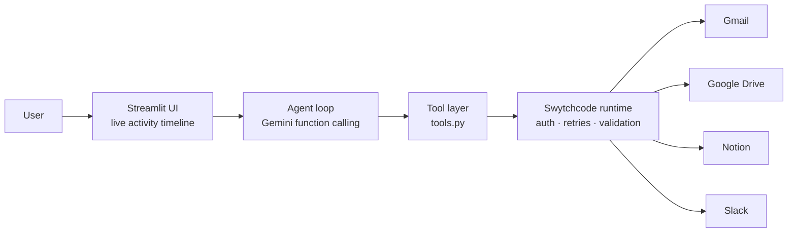

# Knowledge Agent

An AI agent that answers questions about a team's work by searching and reading **Gmail, Google Drive and Notion**, connecting information across them, and acting on the result: **saving briefs to Notion, posting to Slack and sending email**.

Built in one day at *Build with Swytchcode, Gurgaon Edition* (Track 2: AI Knowledge Worker).


## What it does

Ask: *"Brief me on the Orion vendor contract, save it to Notion and notify the team on Slack."*

The agent:
1. Searches Gmail, Drive and Notion in parallel.
2. Reads the relevant emails, documents and pages, and follows references between them. For example, an email says "see the Orion Pricing Proposal v3 doc", so the agent opens that doc in Drive.
3. Spots conflicts between sources. The Notion project page says go-live is **Nov 1**; the latest vendor email says **Nov 15**. The brief flags this.
4. Writes a cited brief (decisions, open items with owners, conflicts), saves it as a Notion page and posts the link to Slack.

## Architecture



- **`tools.py`**: small, purpose-built tools (`search_gmail`, `read_drive_file`, `create_notion_page`, ...). Each one calls a Swytchcode method and trims the response to what the model needs.
- **`agent.py`**: a hand-written tool-calling loop. The model asks for tool calls, the loop runs them, and the results go back to the model until it answers. Every step is emitted as an event, so the UI can show it live.
- **`app.py`**: a Streamlit console showing a live timeline, the answer, the actions taken, and links to every source that was read.

## Design decisions

- **Narrow tools rather than raw API access.** The model sees about 9 clear tools instead of hundreds of API methods. That makes it choose the right tool more reliably and keeps each tool's permissions small.
- **Least privilege.** Swytchcode's `tooling.json` works as an allow-list, so only the methods the agent needs are enabled. Delete and trash are never enabled.
- **Guarded write actions.** The agent only saves, posts or emails when explicitly asked. Email can only go to addresses on an allow-list in `.env`.
- **No credentials in code.** OAuth tokens for every provider are managed by Swytchcode and stored locally, never in the repo or passed through the model.
- **Resilient to free-tier limits.** The agent backs off on rate limits and switches to a fallback model when one model's daily quota runs out.

## Tech stack

Python · Google Gemini (function calling) · Swytchcode (CLI and Python runtime) · Streamlit

## Setup

```bash
npm install -g swytchcode
pip install -r requirements.txt
swy login
swy init
swy get gmail && swy get google-drive && swy get notion && swy get slack
swy add method gmail.user.messages.get      # plus the other methods listed in tools.py
swy auth connect gmail                      # repeat for google-drive, notion, slack
cp .env.example .env                        # fill in the values
python -m streamlit run app.py
```

Test tools without using any model quota: `python tools.py`.

## Known limitations

- **Slack is output only.** Reading channel history fails with `missing_scope`: the managed Slack connection doesn't request `channels:history`.
- **Drive is read only.** Creating files with content needs Drive's upload endpoint.
- **Search depends on keywords.** Results are only as good as each provider's own search.
- **Runs locally.** Provider credentials live on the machine running the Swytchcode CLI.

## Roadmap

- Read Slack using a custom Slack app token with `channels:history`
- Google Calendar: "brief me before my 3pm meeting"
- A search index (e.g. OpenSearch) across all sources, so the agent can search semantically instead of relying on each provider's keyword search
- Human approval for outgoing email using Swytchcode's approval policies
